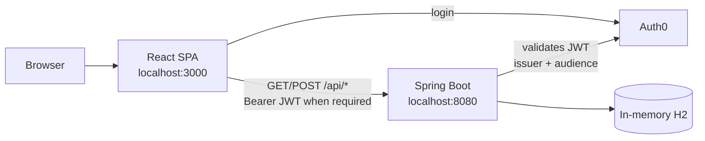
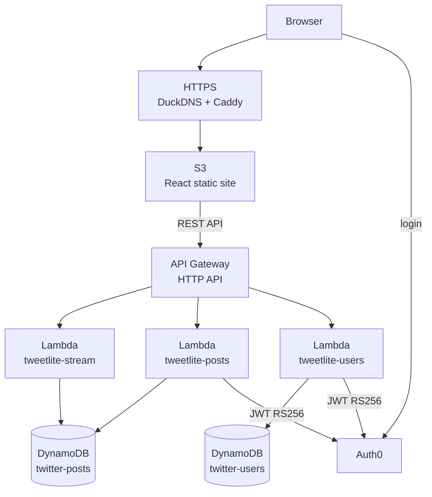
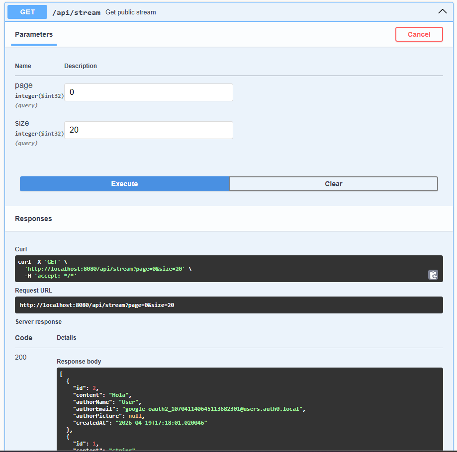
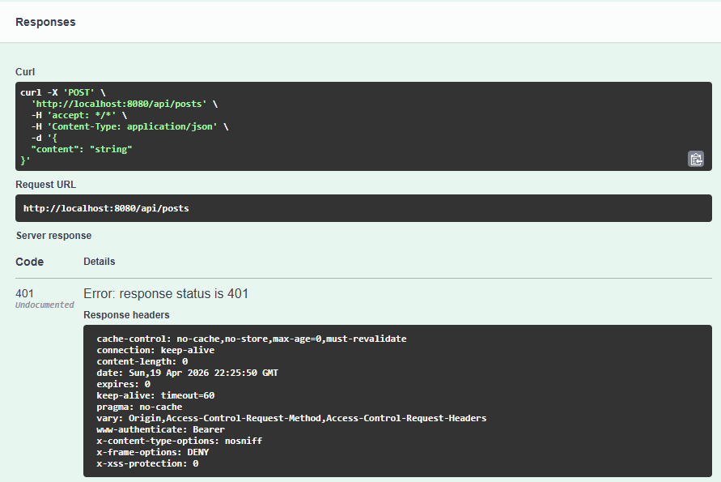
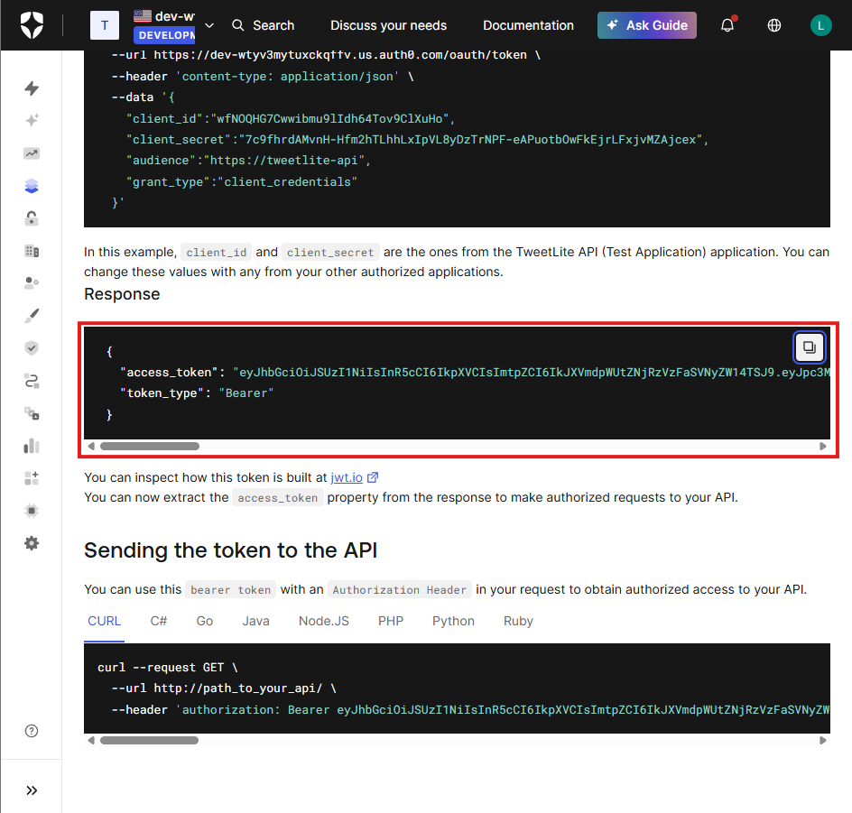
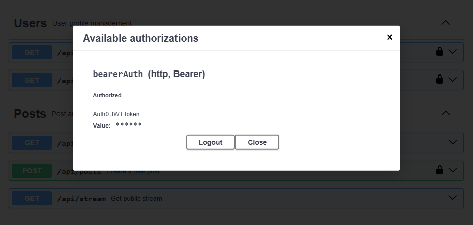
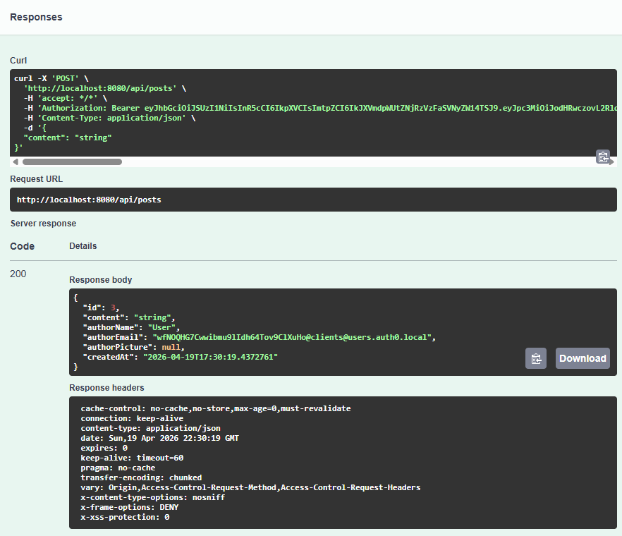
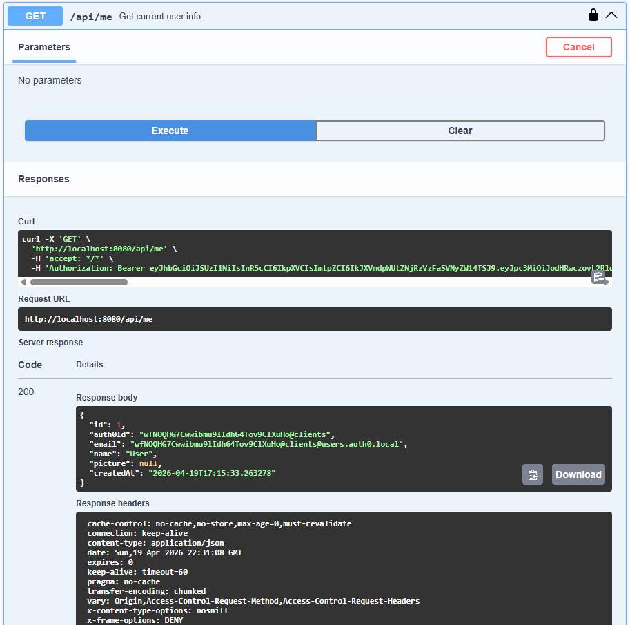

# TweetLite — Twitter-like App with Microservices and Auth0

Project for the Enterprise Architectures workshop at Escuela Colombiana de Ingenieria Julio Garavito. A Twitter-like application with JWT security using Auth0, evolving from a Spring Boot monolith to serverless microservices on AWS Lambda.

---

## Overview

TweetLite allows authenticated users to publish short messages (maximum 140 characters) in a global public feed. The project starts as a Spring Boot monolith and is migrated to three independent microservices deployed on AWS Lambda with API Gateway, a React frontend on S3, and full Auth0 authentication.

---

## Architecture

The system has **two phases** required by the rubric: (1) local Spring Boot monolith and (2) serverless microservices on AWS. The frontend and Auth0 are shared in both phases; only the backend behind `REACT_APP_API_URL` changes.

### Phase 1 — Monolith (local development)



Typical monolith routes (all under **`/api`**):

| Method | Route | Auth |
|--------|------|------|
| GET | `/api/posts`, `/api/stream` | Public |
| POST | `/api/posts` | JWT |
| GET | `/api/me` | JWT |

OpenAPI/Swagger docs: `http://localhost:8080/swagger-ui/index.html`.

### Phase 2 — Production (S3 + HTTPS + API Gateway + Lambda + DynamoDB)

The static frontend is hosted on **S3**; it is usually fronted by **HTTPS** (for example DuckDNS + Caddy on EC2) so Auth0 accepts the origin. The Internet-facing API is **API Gateway**; each route invokes a Java **Lambda**; state is stored in **DynamoDB**.



In the team’s current deployment, API Gateway routes use the same prefix as the monolith (base example: `https://m4ro71bgz4.execute-api.us-east-1.amazonaws.com/prod`):

| Method | Route (after stage `/prod`) | Lambda | Auth |
|--------|------------------------------|--------|------|
| GET | `/api/stream` | tweetlite-stream | Public |
| GET | `/api/posts` | tweetlite-posts | Public |
| POST | `/api/posts` | tweetlite-posts | JWT |
| GET | `/api/me` | tweetlite-users | JWT |

### Security flow (Auth0 + JWT)

1. The user signs in in the SPA; Auth0 returns an **access token** (JWT) with audience `https://tweetlite-api`.
2. The frontend sends `Authorization: Bearer <token>` in protected requests.
3. **Monolith:** Spring Security OAuth2 Resource Server validates the JWT (Auth0 JWKS + audience).
4. **Lambdas:** `JwtValidator` validates RS256 signature, `iss`, and `aud` against `AUTH0_DOMAIN` and `AUTH0_AUDIENCE`.
5. Without a valid token, protected `POST` creation and `GET /api/me` return **401**.

---

## Deployed project links

| Resource | URL |
|---|---|
| Frontend (HTTPS) | https://tweetlite.duckdns.org |
| Frontend (S3 HTTP) | http://tweetlite-962733155713.s3-website-us-east-1.amazonaws.com |
| API Gateway base URL | https://m4ro71bgz4.execute-api.us-east-1.amazonaws.com/prod |
| Swagger UI (local monolith) | http://localhost:8080/swagger-ui/index.html |

---

## Repository structure

```
tweetlite/
├── README.md
├── images/                              # Documentation / evidence screenshots
├── monolith/                            # Phase 1: Spring Boot 3.2 + JPA + OAuth2 Resource Server + OpenAPI
│   ├── pom.xml
│   └── src/
│       ├── main/
│       │   ├── java/co/edu/escuelaing/tweetlite/
│       │   │   ├── TweetliteApplication.java
│       │   │   ├── config/            # SecurityConfig, AudienceValidator, OpenApiConfig
│       │   │   ├── controller/        # PostController, UserController
│       │   │   ├── dto/               # PostRequest, PostResponse, UserResponse
│       │   │   ├── model/             # User, Post (JPA)
│       │   │   ├── repository/
│       │   │   └── service/           # PostService, UserService
│       │   └── resources/
│       │       └── application.yml
│       └── test/java/co/edu/escuelaing/tweetlite/
│           └── PostControllerTest.java
├── microservices/                       # Phase 2: three Java Lambdas (API Gateway)
│   ├── posts-service/
│   │   ├── pom.xml
│   │   └── src/main/java/co/edu/escuelaing/
│   │       ├── PostsHandler.java        # GET/POST posts (JWT required on POST)
│   │       └── JwtValidator.java
│   ├── users-service/
│   │   ├── pom.xml
│   │   └── src/main/java/co/edu/escuelaing/
│   │       ├── UserHandler.java         # GET profile (/me)
│   │       └── JwtValidator.java
│   └── stream-service/
│       ├── pom.xml
│       └── src/main/java/co/edu/escuelaing/
│           └── StreamHandler.java       # GET public stream
└── frontend/                            # React 18 (CRA) + @auth0/auth0-react
    ├── package.json
    ├── public/
    ├── src/
    ├── .env                             # local (do not version secrets)
    └── build/                           # output from npm run build -> sync to S3
```

---

## Auth0 configuration

### 1. Create API (Resource Server)

- Auth0 Dashboard -> Applications -> APIs -> Create API
- **Name:** `TweetLite API`
- **Identifier (Audience):** `https://tweetlite-api`
- **Signing algorithm:** RS256
- Recommended scopes: `read:posts`, `write:posts`, `read:profile`

### 2. Create SPA application

- Applications -> Create Application -> **Single Page Application**
- **Name:** `TweetLite Frontend`
- Settings:
    - **Allowed Callback URLs:** `https://tweetlite.duckdns.org`
    - **Allowed Logout URLs:** `https://tweetlite.duckdns.org`
    - **Allowed Web Origins:** `https://tweetlite.duckdns.org`

### 3. Authorize the SPA against the API

- Applications -> APIs -> TweetLite API -> **Applications** tab
- Enable (toggle ON) the `TweetLite Frontend` SPA

### 4. Values used in this project

| Variable | Value |
|---|---|
| `AUTH0_DOMAIN` | `dev-wtyv3mytuxckqffv.us.auth0.com` |
| `AUTH0_AUDIENCE` | `https://tweetlite-api` |
| `REACT_APP_AUTH0_CLIENT_ID` | `Mr2Tjbd41ZOZP5XKfzMwFcqkLncUGnmW` |

---

## Local run (monolith + frontend)

### Requirements

- Java 17+
- Maven 3.8+
- Node.js 18+
- npm 9+

### Backend (Spring Boot monolith) — from CMD

```cmd
cd monolith
set AUTH0_DOMAIN=dev-wtyv3mytuxckqffv.us.auth0.com
set AUTH0_AUDIENCE=https://tweetlite-api
set CORS_ALLOWED_ORIGINS=http://localhost:3000
mvn spring-boot:run
```

Locally available URLs:
- API: `http://localhost:8080`
- Swagger UI: `http://localhost:8080/swagger-ui/index.html`
- H2 Console: `http://localhost:8080/h2-console`

### Frontend — from CMD or PowerShell

```bash
cd frontend
npm install
npm start
```

URL: `http://localhost:3000`

### Automated monolith tests

From the `monolith` folder:

```cmd
cd monolith
mvn test
```

You should see **7 tests** in `PostControllerTest` and `BUILD SUCCESS`. The tests use `@MockBean` for `PostService`, `UserService`, and `JwtDecoder` (so Auth0 is not called when bootstrapping the context). If you compile with **Java 23**, `pom.xml` already includes `-Dnet.bytebuddy.experimental=true` in Surefire so Mockito/Byte Buddy works; for the course, **Java 17** is still recommended as the project version.

### Frontend environment variables (`frontend/.env`)

```env
REACT_APP_AUTH0_DOMAIN=dev-wtyv3mytuxckqffv.us.auth0.com
REACT_APP_AUTH0_CLIENT_ID=Mr2Tjbd41ZOZP5XKfzMwFcqkLncUGnmW
REACT_APP_AUTH0_AUDIENCE=https://tweetlite-api
REACT_APP_API_URL=http://localhost:8080
```

### Swagger tests

1. Open `http://localhost:8080/swagger-ui/index.html`.
2. Verify that the documentation loads (if it does not, check the "Common issues" section).
3. Test public endpoint:
- `GET /api/stream` -> should return `200`.

  

4. Test protected endpoint without token:
- `POST /api/posts` -> should return `401`.

  

5. Get an access token (see the **Where to get the JWT** section above).

   

6. In Swagger click `Authorize` and paste the token (according to the format Swagger asks for).

   

7. Test protected endpoint with token:
- `POST /api/posts` with body `{"content":"hola"}` -> `200`/`201` depending on endpoint.

    

- `GET /api/me` -> `200`.

    


---

## Full AWS deployment (PowerShell — Windows)
 
### Prerequisites
 
- AWS CLI installed (`aws --version`)
- Lab credentials configured (see step 1)
- Java 17 and Maven installed
- Node.js 18+ installed
---
 
### Step 1 — Configure AWS credentials
 
In AWS Academy / Learner Lab, click **"AWS Details"** -> **"Show"** next to "AWS CLI". Copy the credentials and paste them:
 
```powershell
New-Item -ItemType Directory -Force -Path "$env:USERPROFILE\.aws"
New-Item -ItemType File -Force -Path "$env:USERPROFILE\.aws\credentials"
notepad "$env:USERPROFILE\.aws\credentials"
```
 
```
[default]
aws_access_key_id=YOUR_ACCESS_KEY_ID
aws_secret_access_key=YOUR_SECRET_ACCESS_KEY
aws_session_token=YOUR_SESSION_TOKEN
```
 
> **Important:** Lab credentials expire when the session ends. Every time you reopen the lab you must update this file with the new credentials.
 
Verify:
 
```powershell
aws sts get-caller-identity
```
 
---
 
### Step 2 — Define environment variables in PowerShell
 
```powershell
$REGION = "us-east-1"
$AUTH0_DOMAIN = "dev-g5mngajmk4cmyq55.us.auth0.com"
$AUTH0_AUDIENCE = "https://tweetlite-api"
$POSTS_TABLE = "twitter-posts"
$USERS_TABLE = "twitter-users"
$ACCOUNT_ID = (aws sts get-caller-identity --query Account --output text)
$LAMBDA_ROLE_ARN = "arn:aws:iam::" + $ACCOUNT_ID + ":role/LabRole"
$BUCKET = "tweetlite-" + $ACCOUNT_ID
```
 
---
 
### Step 3 — Create DynamoDB tables
 
```powershell
aws dynamodb create-table `
  --table-name $POSTS_TABLE `
  --attribute-definitions AttributeName=id,AttributeType=S `
  --key-schema AttributeName=id,KeyType=HASH `
  --billing-mode PAY_PER_REQUEST `
  --region $REGION
 
aws dynamodb create-table `
  --table-name $USERS_TABLE `
  --attribute-definitions AttributeName=auth0Id,AttributeType=S `
  --key-schema AttributeName=auth0Id,KeyType=HASH `
  --billing-mode PAY_PER_REQUEST `
  --region $REGION
```
 
> If a table already exists, `ResourceInUseException` is returned — that is normal, continue.
 
---
 
### Step 4 — Build microservices (fat JAR)
 
```powershell
cd microservices\posts-service
mvn clean package -q
cd ..\..
 
cd microservices\users-service
mvn clean package -q
cd ..\..
 
cd microservices\stream-service
mvn clean package -q
cd ..\..
```
 
Each build must finish with `BUILD SUCCESS`.
 
---
 
### Step 5 — Create or update Lambdas
 
**First time (create):**
 
```powershell
aws lambda create-function `
  --function-name tweetlite-posts `
  --runtime java17 `
  --handler co.edu.escuelaing.PostsHandler::handleRequest `
  --zip-file fileb://microservices/posts-service/target/posts-service-1.0-SNAPSHOT.jar `
  --role $LAMBDA_ROLE_ARN `
  --timeout 30 `
  --memory-size 512 `
  --environment "Variables={POSTS_TABLE=$POSTS_TABLE,AUTH0_DOMAIN=$AUTH0_DOMAIN,AUTH0_AUDIENCE=$AUTH0_AUDIENCE}" `
  --region $REGION
 
aws lambda create-function `
  --function-name tweetlite-users `
  --runtime java17 `
  --handler co.edu.escuelaing.UserHandler::handleRequest `
  --zip-file fileb://microservices/users-service/target/users-service-1.0-SNAPSHOT.jar `
  --role $LAMBDA_ROLE_ARN `
  --timeout 30 `
  --memory-size 512 `
  --environment "Variables={USERS_TABLE=$USERS_TABLE,AUTH0_DOMAIN=$AUTH0_DOMAIN,AUTH0_AUDIENCE=$AUTH0_AUDIENCE}" `
  --region $REGION
 
aws lambda create-function `
  --function-name tweetlite-stream `
  --runtime java17 `
  --handler co.edu.escuelaing.StreamHandler::handleRequest `
  --zip-file fileb://microservices/stream-service/target/stream-service-1.0-SNAPSHOT.jar `
  --role $LAMBDA_ROLE_ARN `
  --timeout 30 `
  --memory-size 512 `
  --environment "Variables={POSTS_TABLE=$POSTS_TABLE}" `
  --region $REGION
```
 
**If Lambdas already exist (update code):**
 
```powershell
aws lambda update-function-code --function-name tweetlite-posts --zip-file fileb://microservices/posts-service/target/posts-service-1.0-SNAPSHOT.jar --region $REGION
 
aws lambda update-function-code --function-name tweetlite-users --zip-file fileb://microservices/users-service/target/users-service-1.0-SNAPSHOT.jar --region $REGION
 
aws lambda update-function-code --function-name tweetlite-stream --zip-file fileb://microservices/stream-service/target/stream-service-1.0-SNAPSHOT.jar --region $REGION
```
 
---
 
### Step 6 — API Gateway
 
From the AWS Console -> API Gateway:
 
1. Create a new **HTTP API** named `tweetlite-api`
2. Create these routes:
| Method | Route | Lambda |
|---|---|---|
| GET | /api/stream | tweetlite-stream |
| GET | /api/posts | tweetlite-posts |
| POST | /api/posts | tweetlite-posts |
| GET | /api/me | tweetlite-users |
 
3. For each route attach the corresponding Lambda integration and set **Payload format version** to `1.0`
4. Configure CORS:
   - **Allow origins:** `https://tweetlite2.duckdns.org`
   - **Allow headers:** `Content-Type, Authorization`
   - **Allow methods:** `GET, POST, OPTIONS`
5. Verify stage `$default` exists with **Auto-deploy** enabled
Base API URL: `https://678rh58i1c.execute-api.us-east-1.amazonaws.com`
 
> **Note:** JWT validation is done inside each Lambda using `JwtValidator`, so no API Gateway authorizer is required.
 
---
 
### Step 7 — Build and deploy frontend to S3
 
Create `frontend/.env`:
 
```env
REACT_APP_AUTH0_DOMAIN=dev-g5mngajmk4cmyq55.us.auth0.com
REACT_APP_AUTH0_CLIENT_ID=Pgr31dkEknl75t6ndtQHrqhV3dtEsBnG
REACT_APP_AUTH0_AUDIENCE=https://tweetlite-api
REACT_APP_API_URL=https://678rh58i1c.execute-api.us-east-1.amazonaws.com
```
 
Build and deploy:
 
```powershell
cd frontend
npm install
npm run build
cd ..
 
aws s3 mb "s3://$BUCKET" --region $REGION
 
aws s3api put-public-access-block `
  --bucket $BUCKET `
  --public-access-block-configuration "BlockPublicAcls=false,IgnorePublicAcls=false,BlockPublicPolicy=false,RestrictPublicBuckets=false"
 
$policyContent = @"
{
  "Version": "2012-10-17",
  "Statement": [
    {
      "Sid": "PublicReadGetObject",
      "Effect": "Allow",
      "Principal": "*",
      "Action": "s3:GetObject",
      "Resource": "arn:aws:s3:::$BUCKET/*"
    }
  ]
}
"@
$policyContent | Out-File -FilePath "bucket-policy.json" -Encoding ascii
aws s3api put-bucket-policy --bucket $BUCKET --policy file://bucket-policy.json
 
aws s3 website "s3://$BUCKET" --index-document index.html --error-document index.html
 
aws s3 sync "frontend/build/" "s3://$BUCKET" --delete
```
 
S3 bucket URL: `http://tweetlite-036549363372.s3-website-us-east-1.amazonaws.com`
 
---
 
### Step 8 — HTTPS with EC2 + Caddy + DuckDNS
 
#### 8.1 Create domain in DuckDNS
 
1. Go to https://www.duckdns.org and sign in
2. Create subdomain `tweetlite2`
3. Update IP with the EC2 public IP after launching
Domain: `tweetlite2.duckdns.org`
 
#### 8.2 Create EC2 (Amazon Linux 2023)
 
AWS Console -> EC2 -> Launch instance:
 
- **Name:** `tweetlite-proxy`
- **AMI:** Amazon Linux 2023
- **Instance type:** `t2.micro`
- **Key pair:** create `tweetlite-key` (.pem format)
- **Security group:** open ports 22 (SSH), 80 (HTTP), 443 (HTTPS)
Copy the public IP and update DuckDNS.
 
#### 8.3 Connect via SSH
 
```powershell
ssh -i "C:\Users\ders1\Downloads\tweetlite-key.pem" ec2-user@<EC2_PUBLIC_IP>
```
 
#### 8.4 Install Caddy
 
```bash
curl -fsSL https://github.com/caddyserver/caddy/releases/download/v2.9.1/caddy_2.9.1_linux_amd64.tar.gz -o caddy.tar.gz
tar -xzf caddy.tar.gz
sudo mv caddy /usr/local/bin/
caddy version
```
 
#### 8.5 Configure Caddy
 
```bash
sudo mkdir -p /etc/caddy
sudo nano /etc/caddy/Caddyfile
```
 
```
tweetlite2.duckdns.org {
  reverse_proxy http://tweetlite-036549363372.s3-website-us-east-1.amazonaws.com {
    header_up Host tweetlite-036549363372.s3-website-us-east-1.amazonaws.com
  }
}
```
 
```bash
sudo caddy start --config /etc/caddy/Caddyfile
```
 
---
 
### Reactivating after lab restart
 
Every time the lab session restarts:
 
1. Update credentials in `$env:USERPROFILE\.aws\credentials`
2. Redefine PowerShell variables (Step 2)
3. Start EC2 instance from AWS Console
4. Update new public IP in DuckDNS
5. SSH into EC2 and restart Caddy:
```bash
ssh -i "C:\Users\ders1\Downloads\tweetlite-key.pem" ec2-user@<NEW_IP>
sudo caddy start --config /etc/caddy/Caddyfile
```
 
---
 
## Functional verification
 
```powershell
# Public endpoints — should return 200
curl https://678rh58i1c.execute-api.us-east-1.amazonaws.com/api/stream
curl https://678rh58i1c.execute-api.us-east-1.amazonaws.com/api/posts
 
# Protected endpoints without token — should return 401
curl -X POST https://678rh58i1c.execute-api.us-east-1.amazonaws.com/api/posts
curl https://678rh58i1c.execute-api.us-east-1.amazonaws.com/api/me
```
 
Frontend verification:
1. Open `https://tweetlite2.duckdns.org`
2. Click **Sign In** -> redirected to Auth0 -> sign in
3. View public posts feed
4. Publish a new post (max 140 characters)
5. Verify the post appears in the feed
---
### Swagger (local monolith)

1. Start the monolith locally (see local run section)
2. Open `http://localhost:8080/swagger-ui/index.html`
3. Click **Authorize** -> paste Auth0 access token
4. Test `GET /api/stream` -> 200
5. Test `POST /api/posts` without token -> 401
6. Test `POST /api/posts` with token and body `{"content": "hola"}` -> 201
7. Test `GET /api/me` with token -> 200

---
## General deployment + DuckDNS test


---

## Microservices — Technical summary

| Microservice | Handler | Routes | DynamoDB |
|---|---|---|---|
| posts-service | `PostsHandler` | GET /api/posts, POST /api/posts | twitter-posts |
| users-service | `UserHandler` | GET /api/me | twitter-users |
| stream-service | `StreamHandler` | GET /api/stream | twitter-posts (read) |

Each microservice includes its own `JwtValidator` that validates JWT directly against Auth0 JWKS (`https://{domain}/.well-known/jwks.json`), checking issuer and audience.

---

## Security best practices

- Do not commit `.env`, secrets, or tokens to the repository
- Use environment variables for `AUTH0_DOMAIN`, `AUTH0_AUDIENCE`, `CLIENT_ID`
- AWS lab credentials expire; never commit them
- Always validate JWT by issuer + audience + RS256 signature
- Clearly separate public and protected endpoints according to the rubric

---

## Team members

- Laura Natalia Perilla
- Tomas Espitia
- Daniel Esteban Rodriguez Suarez

---

## Demo video

- Video link: https://youtu.be/hJIgbn5XFLg
